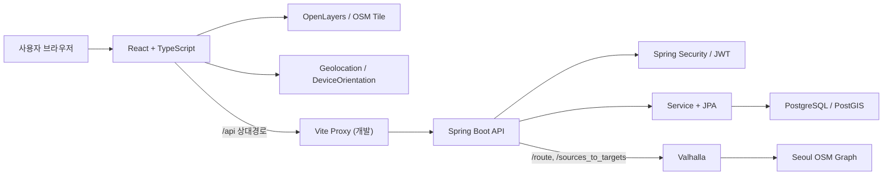

# Popup Store Map 프로젝트 전체 분석 보고서

작성일: 2026-07-26
분석 대상 브랜치: `feat/member-features`

## 1. 요약

현재 프로젝트는 단순 지도 CRUD 프로토타입을 넘어 다음 기능까지 구현된 풀스택 서비스다.

- 회원가입·로그인·JWT 인증·Refresh Token Rotation
- 팝업 조회·검색·필터·페이징·주목할 팝업 랭킹
- 익명/회원 좋아요와 참여 지표
- 즐겨찾기·방문 기록·리뷰·마이페이지
- OpenLayers 지도·GPS·방향 표시
- Valhalla 도보 경로·경로 이탈 재탐색
- Held–Karp 기반 방문 순서 최적화

포트폴리오 소재로는 충분히 강하다. 다만 현재 상태로 운영 배포하기에는 다음 두 문제가 가장 크다.

1. 팝업스토어 생성·수정·삭제 API가 인증 없이 허용된다.
2. Flyway/Liquibase 없이 `ddl-auto=update`에 의존하며 실제 DB 스키마와 Entity 정의가 일부 불일치한다.

---

## 2. 프로젝트 구조

### 2.1 루트 구조

```text
popup-store-map/
├── backend/
│   ├── docs/
│   │   └── member-schema-postgresql.sql
│   ├── gradle/
│   ├── src/
│   │   ├── main/
│   │   │   ├── java/com/inseongbeen/popupstoremap/
│   │   │   └── resources/
│   │   └── test/
│   ├── build.gradle
│   └── settings.gradle
├── frontend/
│   ├── public/
│   ├── src/
│   │   ├── api/
│   │   ├── components/
│   │   ├── features/
│   │   ├── map/
│   │   └── types/
│   ├── package.json
│   └── vite.config.ts
├── docker-compose.yml
├── README.md
└── CHANGELOG.md
```

| 구분 | 개수 |
|---|---:|
| Backend main Java 파일 | 91 |
| Entity | 13 |
| Controller | 9 |
| Service | 8 |
| Repository | 10 |
| DTO 파일 | 27 |
| Frontend `src` 파일 | 67 |
| Backend 테스트 파일 | 14 |
| Frontend 테스트 파일 | 15 |

### 2.2 Backend 패키지

```text
com.inseongbeen.popupstoremap
├── auth
│   ├── config
│   ├── controller
│   ├── dto
│   ├── entity
│   ├── exception
│   ├── repository
│   ├── security
│   └── service
├── common
│   └── exception
├── config
├── favorite
├── popupstore
│   ├── config
│   ├── controller
│   ├── dto
│   ├── engagement
│   ├── entity
│   ├── exception
│   ├── repository
│   └── service
├── review
├── route
│   ├── client
│   ├── config
│   ├── controller
│   ├── dto
│   ├── exception
│   └── service
└── visit
```

기능 단위 패키징과 레이어 분리가 혼합된 구조다. 작은 프로젝트에는 이해하기 쉽지만 `popupstore`가 favorite/review/visit/engagement를 모두 조합하면서 중심 모듈의 결합도가 높아졌다.

### 2.3 주요 Entity

| Entity | 테이블 | 역할 |
|---|---|---|
| `PopupStore` | `popup_store` | 팝업 기본 정보와 위·경도 |
| `AppUser` | `app_user` | 회원 계정 |
| `RefreshToken` | `refresh_token` | 해시된 Refresh Token |
| `PopupFavorite` | `popup_favorite` | 회원 즐겨찾기 |
| `VisitHistory` | `visit_history` | 회원 방문 기록 |
| `PopupReview` | `popup_review` | 방문 후 리뷰 |
| `PopupReviewSummary` | `popup_review_summary` | 평점 합·개수·평균 |
| `PopupLike` | `popup_like` | 익명 또는 회원 좋아요 |
| `PopupEngagementEvent` | `popup_engagement_event` | 조회·일정 추가 이벤트 |
| `PopupEngagementSummary` | `popup_engagement_summary` | 조회·좋아요·일정 합계 |

### 2.4 주요 Controller/API

| Controller | API |
|---|---|
| `AuthController` | `/api/auth/**` |
| `PopupStoreController` | `/api/popup-stores/**` |
| `PopupEngagementController` | `/api/popup-stores/{id}/engagement/**` |
| `PedestrianRouteController` | `/api/routes/**` |
| `PopupFavoriteController` | `/api/users/me/favorites/**` |
| `VisitHistoryController` | `/api/users/me/visits/**` |
| `PopupReviewController` | `/api/popup-stores/{id}/reviews/**` |
| `MyReviewController` | `/api/users/me/reviews` |

### 2.5 외부 의존성

- PostgreSQL 17
- PostGIS 3.6.4
- Valhalla Docker 서버
- BBBike Seoul OSM PBF
- OpenStreetMap 기본 타일
- Browser Geolocation API
- DeviceOrientation API
- Cloudflare Quick Tunnel: 개발 검증용
- Springdoc/Swagger UI
- Axios
- OpenLayers

### 2.6 시스템 동작



Access Token은 Frontend 메모리에만 저장되고 Refresh Token은 HttpOnly Cookie로 전달된다. Backend는 Refresh Token 원문이 아닌 SHA-256 해시만 DB에 저장한다.

---

## 3. 기능 현황

| 기능 | Frontend | API | Service | Entity/Table |
|---|---|---|---|---|
| 회원가입 | `AuthModal`, `AuthProvider` | `POST /api/auth/signup` | `AuthService` | `AppUser` |
| 로그인 | `AuthModal`, `AuthProvider` | `POST /api/auth/login` | `AuthService` | `AppUser`, `RefreshToken` |
| 로그아웃 | Header/MyPage | `POST /api/auth/logout` | `AuthService` | `RefreshToken` |
| 세션 갱신 | Axios interceptor | `POST /api/auth/refresh` | `AuthService` | `RefreshToken` |
| 내 회원정보 | Auth Context | `GET /api/auth/me` | `AuthService` | `AppUser` |
| 팝업 CRUD | 조회 UI만 존재 | `/api/popup-stores` | `PopupStoreService` | `PopupStore` |
| 검색·필터 | Floating Search, Discovery | `GET /api/popup-stores/search` | `PopupStoreService` | `PopupStore` |
| Featured popup | 홈 Featured 영역 | `GET /api/popup-stores/featured` | `PopupStoreService` | 팝업·참여 테이블 |
| 상세 조회 통계 | 상세 Modal/Drawer | `POST .../engagement/view` | `PopupEngagementService` | Event/Summary |
| 일정 추가 통계 | 경로 선택 | `POST .../engagement/plan-add` | `PopupEngagementService` | Event/Summary |
| 좋아요 | 카드·상세 | `PUT/DELETE .../engagement/like` | `PopupEngagementService` | `PopupLike` |
| 즐겨찾기 | 카드·상세·MyPage | `/api/users/me/favorites` | `PopupFavoriteService` | `PopupFavorite` |
| 방문 기록 | 상세·Navigation | `/api/users/me/visits` | `VisitHistoryService` | `VisitHistory` |
| 리뷰 목록 | 상세 후기 탭 | `GET .../reviews` | `PopupReviewService` | Review/Summary |
| 리뷰 작성·수정·삭제 | 상세 후기 탭 | `POST/PATCH/DELETE .../reviews` | `PopupReviewService` | Review/Summary |
| 내 리뷰 | MyPage | `GET /api/users/me/reviews` | `PopupReviewService` | `PopupReview` |
| OSM 지도 | `PopupStoreMap` | 직접 OSM 타일 | — | — |
| 다중 선택 | `RoutePlanner` | 없음, Frontend 상태 | — | 저장되지 않음 |
| 성수역/현재 위치 출발 | Route hooks | 경로 요청에 포함 | Route Service | 저장되지 않음 |
| 도보 경로 | Map/RoutePlanner | `POST /api/routes/pedestrian` | `PedestrianRouteService` | Valhalla |
| 방문 순서 최적화 | `useRoutePlanner` | `POST .../pedestrian/optimize` | Optimization Service | Valhalla matrix |
| 실시간 길안내 | Navigation hooks | 이탈 시 경로 재요청 | Route Service | 위치 미저장 |
| GPS/Heading | `useCurrentLocation` | 브라우저 API | — | 위치 미저장 |
| 자동 경로 재탐색 | Navigation hook | 도보 경로 API | Route Service | — |
| ETA·남은 거리 | Navigation UI | 경로 응답 기반 | — | — |
| 테마 | App/Header | 없음 | — | LocalStorage |
| 최근 검색어 | FloatingSearch | 없음 | — | LocalStorage |

코드에는 exact Held–Karp 알고리즘 기반 열린 경로 최적화가 실제 구현되어 있다.

---

## 4. Backend Architecture Review

| 현재 구조 | 문제점 | 문제가 되는 이유 | 개선 방향 | 우선순위 |
|---|---|---|---|---|
| `PopupStoreService`가 CRUD·검색·랭킹·리뷰·참여·개인화를 조합 | 책임 과다 | favorite/review/visit에 직접 의존 | Query/Command/Ranking Service 분리 | High |
| `popupstore`와 favorite/review/visit가 상호 참조 | 패키지 의존 순환 | 독립 모듈화가 어려움 | ID 기반 Query Port 또는 Application Facade | High |
| CRUD Controller에 관리자 개념이 없음 | 관리 API 권한 부재 | 공개 API와 관리 기능 경계가 동일 | Admin API/Use Case 분리 | Critical |
| Service가 `Authentication`을 직접 받음 | Security 프레임워크 결합 | 단위 테스트와 재사용성 저하 | Controller에서 userId/Principal로 변환 | Medium |
| DTO와 Entity는 분리됨 | `PopupStoreResponseDto`가 여러 도메인을 포함 | 모든 조회가 복합 조회를 강제 | 목록·상세·관리 DTO 분리 | Medium |
| 팝업 날짜·상태 불변식 없음 | 상태 불일치 | 운영기간과 OPEN/CLOSED가 어긋남 | 도메인 검증 또는 상태 계산 정책 | High |
| 공통 예외가 기능 예외를 직접 import | 의존 방향 역전 | 공통 모듈 독립성 저하 | 공통 오류 계약과 도메인 오류 코드 | Medium |
| `IllegalArgumentException` 메시지 직접 반환 | 내부 구현 노출 | 내부 필드명이 외부 계약이 됨 | 오류 코드와 공개 메시지 매핑 | Medium |
| Route 클래스가 `ObjectMapper` 직접 생성 | Spring 설정 무시 | 직렬화 정책 분산 | Bean 주입 | Low |
| Valhalla 4xx를 모두 경로 없음으로 처리 | 오류 분류 부족 | 설정·rate limit도 422로 오인 | 상태/오류 코드별 매핑 | Medium |
| Pageable 정규화 반복 | 정책 중복 | 크기·정렬 정책 분산 | 공통 Pageable 정책 객체 | Low |
| `ddl-auto=update` | 암묵적 스키마 변경 | 재현·롤백·검토 어려움 | Flyway와 `validate` | Critical |

### 유지할 만한 Backend 설계

- Controller–Service–Repository 기본 레이어
- Entity와 DTO 분리
- record DTO
- 읽기 전용 트랜잭션 기본값
- 정렬 필드 whitelist
- LIKE 특수문자 escape
- Valhalla Client 인터페이스
- 순수 함수에 가까운 polyline6/최적화 알고리즘
- 런타임 Spring Bean 순환 의존성이 없는 점

---

## 5. Security Review

| 항목 | 평가 | 근거 |
|---|---|---|
| Spring Security 설정 | **FAIL** | `/api/popup-stores/**` 전체 permitAll |
| JWT 생성·검증 | **PASS** | HS256, issuer, 발급·만료 시각 |
| JWT Secret 길이 | **PASS** | 최소 32바이트 강제 |
| Access Token | **PASS** | 15분 TTL, Frontend 메모리 저장 |
| JWT audience/jti | **WARNING** | audience·토큰 식별자 없음 |
| Refresh Token | **PASS** | 난수 생성, SHA-256 해시 저장 |
| Refresh Token Rotation | **WARNING** | 이전 토큰 폐기는 하지만 reuse family 폐기 없음 |
| Refresh Token 정리 | **WARNING** | 만료·폐기 토큰 정리 작업 없음 |
| BCrypt | **PASS** | `BCryptPasswordEncoder` |
| 인증 | **PASS** | Resource Server JWT |
| 팝업 CRUD 인가 | **FAIL** | POST/PUT/DELETE 공개 |
| Role 기반 인가 | **FAIL** | `ADMIN` 역할이 실질적으로 사용되지 않음 |
| 사용자 데이터 격리 | **PASS** | 서버가 인증 사용자 ID 결정 |
| 리뷰 객체 권한 | **PASS** | reviewId/popupId/owner 검증 |
| CORS | **WARNING** | dev localhost 제한, 운영 정책 없음 |
| CSRF | **WARNING** | 전역 비활성, Origin/SameSite로 부분 보완 |
| Origin 검증 | **WARNING** | refresh/logout POST만 검사 |
| HttpOnly | **PASS** | Refresh Cookie 적용 |
| SameSite | **PASS** | Lax |
| Secure Cookie | **WARNING** | 환경변수 기반, 기본 false |
| Cookie Path | **PASS** | `/api/auth` |
| 입력 Validation | **WARNING** | PopupStore 길이·좌표·날짜 관계 부족 |
| SQL Injection | **PASS** | JPA·바인딩·sort whitelist |
| XSS | **PASS/WARNING** | React escape, HTML 직접 삽입 없음. CSP/이미지 제한 없음 |
| 로그인 brute force | **FAIL** | rate limit·계정 잠금 없음 |
| 익명 통계 조작 | **FAIL** | 클라이언트 visitor/session ID와 rate limit 부재 |
| Route API 남용 | **FAIL** | 공개 API 호출 제한 없음 |
| 민감정보 로그 | **WARNING** | token/payload는 없지만 SQL 출력 활성화 |
| Secret 하드코딩 | **PASS** | main 코드 비밀키 하드코딩 없음 |
| 설정 파일 | **WARNING** | datasource/ddl-auto/show-sql 설정 Git 추적 |
| `.env` | **PASS** | 실제 파일 ignore, example만 추적 |
| 빌드 산출물 추적 | **PASS** | node_modules/dist/build 등 미추적 |
| 내부 오류 노출 | **WARNING** | Route는 정제되지만 generic 오류 계약 부족 |
| Swagger 운영 노출 | **WARNING** | production 비활성 정책 없음 |

### OWASP 핵심

- **A01 Broken Access Control:** 팝업 CRUD 공개
- **A04 Insecure Design:** 클라이언트가 방문 기록을 직접 생성해 리뷰 자격 확보 가능
- **A05 Security Misconfiguration:** `ddl-auto=update`, SQL 로그, Swagger, Secure Cookie 기본값
- **A07 Authentication Failures:** rate limit과 Refresh reuse detection 부재
- **A08 Data Integrity Failures:** 마이그레이션 도구 없이 자동 스키마 변경
- **A10 SSRF:** Valhalla 주소는 서버 설정에서만 결정되어 현재 사용자 입력 기반 SSRF는 발견되지 않음

---

## 6. Database / JPA Review

### 6.1 실제 DB 상태

- PostgreSQL 17
- PostGIS 3.6.4
- 팝업스토어 18건
- OPEN 7건
- UPCOMING 6건
- CLOSED 5건
- 분석일 기준 OPEN 2건이 운영기간 밖에 있어 상태 불일치
- PostGIS extension은 존재하지만 공간 컬럼은 없음
- 위치는 `Double latitude`, `Double longitude`

### 6.2 Entity 관계

```text
AppUser
├── RefreshToken (N:1)
├── PopupFavorite (N:1) ── PopupStore
├── VisitHistory (N:1) ── PopupStore
└── PopupReview (N:1) ── PopupStore
                         └── VisitHistory

PopupStore
├── PopupEngagementEvent (scalar popupStoreId)
├── PopupEngagementSummary (scalar popupStoreId)
├── PopupLike (scalar popupStoreId)
└── PopupReviewSummary (scalar popupStoreId)
```

모든 명시적 `ManyToOne`은 LAZY다. Cascade와 orphanRemoval은 사용하지 않는다.

### 6.3 실제 스키마 불일치

- Entity에서는 `PopupStore.name`이 `nullable=false`지만 실제 DB에서는 nullable
- `PopupStore.description`이 PostgreSQL에서 `text`가 아닌 `oid`
- `popup_review_summary.popup_store_id` 실제 FK 없음
- `popup_engagement_summary.popup_store_id` 실제 FK 없음
- `popup_engagement_event.popup_store_id` 실제 FK 없음
- `popup_like.popup_store_id` 실제 FK 없음
- 문서 SQL의 review rating/content CHECK가 실제 DB에서 확인되지 않음
- `RefreshToken.replacedByTokenId`는 자기참조 FK가 아님

팝업 삭제 시 관계가 있는 Favorite/Visit/Review 때문에 실패하거나 FK가 없는 Engagement/Summary/Like에 orphan 데이터가 남을 수 있다.

### 6.4 Index

존재:

- 사용자 이메일 unique
- Refresh Token hash/user
- Favorite user/store
- Visit user/date/store
- Review store/created/user/visit
- Like visitor/user unique
- Engagement session unique

측정 또는 보강 후보:

- `popup_store` 검색용 인덱스
- `lower(name)` 부분검색용 `pg_trgm`/GIN
- category/status/startDate/endDate 복합 인덱스
- engagement `occurred_at`
- like `created_at`

현재 18건에서는 성능 문제가 아니며 운영 규모에서 측정해야 한다.

### 6.5 N+1 및 Query

양호:

- Favorite/Visit/My Review에 EntityGraph 사용
- 팝업 목록 개인화는 ID 목록 기반 배치 조회
- 참여 및 리뷰 요약도 ID 집합으로 조회

잠재적 문제:

- 리뷰 목록에서 각 리뷰마다 `verified()` 조회가 발생할 가능성
- Featured가 모든 OPEN/UPCOMING을 메모리로 가져와 정렬

### 6.6 Pagination

- 검색·즐겨찾기·방문·리뷰는 Offset Pagination
- size 최대 50 또는 100
- 전체 팝업 API는 비페이징
- Frontend는 최대 100건만 읽어 100건 초과 데이터가 UI에서 누락될 수 있음

### 6.7 동시성

양호:

- 참여/리뷰 summary 갱신 시 `PESSIMISTIC_WRITE`
- Favorite/Visit는 unique constraint와 충돌 예외로 경쟁 상태 방어
- Engagement Event는 session unique

잠재적:

- 인기 팝업에 대한 단일 행 잠금 병목
- 익명 좋아요 병합 동시 실행
- 동일 Refresh Token 동시 rotation
- `@Version` 필드 없음

### 6.8 PostGIS

PostGIS는 설치되어 있지만 현재 실제 공간 기능에서는 사용하지 않는다.

- Point 없음
- GIST 공간 인덱스 없음
- 반경 검색 없음
- 거리순 검색 없음

포트폴리오에서 PostGIS를 기술로 어필하려면 Point, GIST, 반경/거리 검색 중 하나 이상을 실제 구현하는 편이 좋다.

---

## 7. Frontend Review

### 7.1 장점

- API Layer 분리
- 인증·경로·GPS·Navigation·Favorite custom hook
- Access Token 메모리 보관
- Refresh single-flight
- AbortSignal 사용
- OpenLayers Map cleanup
- Route/Marker/Current Location Layer 분리
- 모바일 Safe Area
- 지도 접근성 select
- 드래그 외 위/아래 순서 버튼

### 7.2 주요 문제

#### App 책임 과다

`App.tsx`가 인증, 검색, 상세, 좋아요, 즐겨찾기, 방문, 리뷰, 경로, GPS, Navigation, Toast, 테마를 모두 조정한다. `HomePage`, `MapExplorer`, `NavigationShell`, `ScheduleCoordinator` 수준으로 분리할 필요가 있다.

#### Geolocation hook 책임 과다

`useCurrentLocation.ts`가 위치 획득, watch, fallback, 권한, DeviceOrientation, smoothing, debug, follow 상태를 모두 처리한다. acquisition, heading sensor, tracking state로 분리하는 것이 좋다.

#### 클라이언트 검색

Backend 검색 API가 있지만 Frontend는 최초 100개를 받아 로컬에서 필터링한다.

- 데이터 100건 초과 시 누락
- Backend 검색 기능 활용 부족
- URL query state 없음

#### 서버 상태 중복

PopupStore 목록, Featured, Favorites, My Reviews가 별도 상태이며 mutation 후 일부 데이터를 수동 동기화한다. 규모가 커지면 React Query 같은 서버 상태 관리 도입 가치가 있다.

#### 렌더링 성능 후보

- engagement/review 변경 시 marker source 전체 재생성
- 현재 위치 애니메이션마다 4개 Feature 재생성
- 일부 callback identity 변경
- Navigation 중 120ms layer redraw

18건에서는 문제라고 단정할 수 없고 React Profiler/Performance 측정이 먼저다.

### 7.3 Error/Loading

양호:

- 팝업·경로·GPS·리뷰·즐겨찾기 사용자 오류 표시
- Valhalla 내부 URL/원문 오류 미노출
- loading/error/empty 상태 구분

개선:

- `useMyReviews` 오류 무시
- 일부 engagement 실패 무시
- 전역 Error Boundary 없음
- offline/retry UX 없음

### 7.4 접근성

양호:

- 주요 버튼 `aria-label`
- Dialog와 Escape 닫기
- 상세 Modal focus trap/복원
- 지도 대체 select
- 키보드 순서 변경
- `focus-visible`
- alert/status
- Safe Area

보강:

- Auth Modal focus trap 없음
- MyPage Drawer focus trap/호출 focus 복원 없음
- 배경 `inert` 없음
- 검색 combobox/listbox 패턴 부족
- Tab의 `aria-controls`/roving tabindex 부족
- `prefers-reduced-motion` 없음

---

## 8. Test Review

### 8.1 수량

| 분류 | 파일 | 테스트 |
|---|---:|---:|
| Backend | 14 | 56 |
| Frontend | 15 | 51 |
| 총합 | 29 | 107 |

Backend:

| 종류 | 테스트 수 |
|---|---:|
| `@SpringBootTest` 서비스/통합 | 25 |
| `@DataJpaTest` Repository | 9 |
| standalone MockMvc Controller | 7 |
| 순수 단위 테스트 | 15 |
| 실제 Security Filter 통합 | 0 |
| PostgreSQL/Testcontainers | 0 |

Frontend는 `tsx --test` 기반 순수 함수/API 변환 테스트다.

- React Testing Library 없음
- Component 렌더 테스트 없음
- E2E 없음
- 실제 OpenLayers lifecycle 테스트 없음

### 8.2 의미 있게 검증되는 규칙

- 이메일 정규화와 BCrypt
- 중복 이메일
- JWT 발급
- Refresh rotation과 이전 토큰 거부
- 로그아웃 idempotency
- 익명 좋아요 회원 병합
- Favorite 사용자 격리
- Visit 사용자 격리
- Review 방문 조건과 소유권
- Review summary 일관성
- Engagement 중복 방지와 동시성
- 검색 조건·날짜 경계·페이징·정렬
- polyline6과 여러 leg 결합
- exact Held–Karp
- 경로 fallback 미사용
- Access Token 메모리 저장
- Refresh single-flight
- GPS fallback과 heading
- 경로 stale
- 중복 선택·최대 8개·순서 변경

### 8.3 부족한 테스트

- 실제 Security FilterChain API
- Cookie/Origin/CORS/CSRF
- ADMIN/USER/anonymous 권한 매트릭스
- Refresh 재사용 공격·동시성
- Popup CRUD Validation
- PostgreSQL/PostGIS Testcontainers
- Flyway migration
- FK/delete 정책
- Query count/N+1
- React Component/Hook
- 401→refresh→원요청 재시도
- 접근성
- 브라우저 E2E

### 8.4 운영 DB 영향

현재 테스트는 H2 in-memory와 `ddl-auto=create-drop`을 사용하므로 로컬 PostgreSQL 데이터를 건드리지 않는다.

---

## 9. 최종 평가

### A. 현재 프로젝트의 장점

- 실제 연결된 풀스택 도메인 프로토타입
- JWT + Refresh Cookie + Rotation
- 사용자 데이터 격리
- Valhalla polyline6 전체 경로 처리
- Held–Karp 최적화
- GPS·Heading·이탈·재탐색·ETA
- 참여/리뷰 summary 동시성 고려
- DTO/LAZY/EntityGraph/Pageable
- 모바일 Safe Area와 접근성
- 중요한 비즈니스 규칙 테스트

### B. 가장 위험한 문제 TOP 10

1. 인증 없이 PopupStore 생성·수정·삭제 가능
2. Flyway/Liquibase 없이 `ddl-auto=update`
3. 실제 DB와 Entity 제약조건 불일치
4. Refresh Token 재사용 탐지와 family 폐기 없음
5. 로그인·통계·Route API rate limit 없음
6. 클라이언트가 임의 방문 기록으로 리뷰 자격 확보 가능
7. Secure Cookie/CORS/Swagger 운영 정책이 환경 실수에 의존
8. PopupStoreService와 App 책임 과다
9. 일부 summary/engagement FK 부재
10. Security Filter/PostgreSQL 통합 테스트 부재

### C. 반드시 리팩토링할 부분

- 팝업 관리 API ADMIN 전용화
- Flyway와 baseline migration
- DB/Entity 정합성 복구
- PopupStore Query/Command/Ranking/Personalization 분리
- Refresh Token lifecycle 개선
- 방문 인증 정책 확립
- Frontend App orchestration 분리
- 서버 상태 캐시/무효화 전략

### D. 유지해도 되는 부분

- 기능 중심 패키지 기본 방향
- Entity/DTO 분리와 record
- LAZY ManyToOne
- EntityGraph
- Pageable whitelist/size 제한
- Valhalla Client 인터페이스
- polyline6 decoder
- `[longitude, latitude]` 계약
- OpenLayers cleanup
- Access Token 메모리
- Refresh single-flight
- Route 상태 모델
- 현재 위치 비저장 정책

### E. 보안 개선사항

- ADMIN 권한
- Security 통합 테스트
- production Secure Cookie 강제
- 운영 CORS allowlist
- Swagger 보호
- rate limiting
- Refresh Token reuse detection/family revocation
- 만료 Token 정리
- CSP와 이미지 도메인 정책
- 공통 오류 코드

### F. 성능 측정 대상

- Featured 메모리 정렬
- 최근 engagement 집계
- 리뷰 verified N+1
- `lower(name) LIKE`
- 팝업 개인화 쿼리
- 위치 Feature 재생성
- marker source rebuild
- OpenLayers bundle
- Navigation redraw
- 깊은 Offset Pagination
- Valhalla matrix/optimization 시간

### G. 테스트 보강 대상

- Security 권한
- Cookie/Origin/CORS
- Refresh reuse/concurrency
- Popup Validation
- Testcontainers/PostGIS
- Flyway
- FK/delete
- Query count
- React Component/Hook
- Axios refresh retry
- 접근성
- Playwright E2E

### H. AWS 배포 전 필수

- Flyway와 `ddl-auto=validate`
- RDS 비밀정보 관리
- JWT Secret 관리
- HTTPS/Secure Cookie
- production CORS
- Swagger 제한
- 백업/복원
- Valhalla 리소스/OSM 갱신
- OSM Tile 정책
- 로그·메트릭·알람
- Health/readiness
- rate limiting
- CI/CD
- dev seed 분리
- DB FK/CHECK/Index 복구

### I. 포트폴리오 어필 요소

- Spring Security JWT 인증
- Refresh Token Rotation/HttpOnly Cookie
- 익명 데이터를 회원으로 병합하는 흐름
- 동시성 제어 summary
- Specification 검색
- OpenLayers lifecycle
- Geolocation/DeviceOrientation
- Self-hosted Valhalla
- polyline6 디코딩
- 여러 leg 결합
- 이탈 판정/재탐색
- Held–Karp 동적 계획법
- 사용자 데이터 격리 테스트
- 모바일/접근성 고려

### J. 추천 리팩토링 순서

1. Security 권한 매트릭스
2. Security 통합 테스트
3. Flyway baseline과 DB 정합성
4. production/dev/test profile
5. PopupStore Validation/상태 정책
6. Refresh Token family/reuse/cleanup
7. 방문·리뷰 자격 정책
8. Backend Query/Command/Facade 분리
9. Frontend App/Geolocation 분리
10. 서버 상태 관리
11. Testcontainers/E2E
12. 성능 측정
13. PostGIS 반경/거리 검색
14. AWS 운영 보안·관측·배포

---

## 10. 분석 당시 작업 상태

- 코드 수정: 없음
- 기존 파일 삭제: 없음
- 테스트/build 실행: 없음
- commit: 없음
- push: 없음
- 분석 당시 Git 작업 트리: clean
