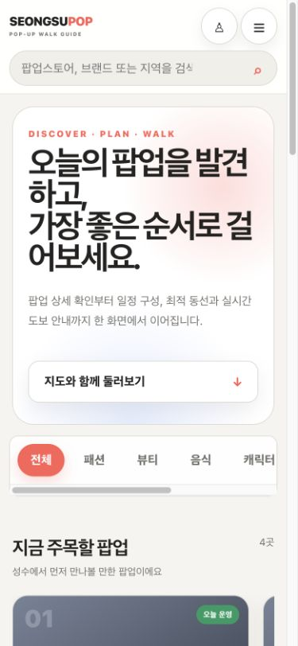

# Popup Store Map

## 📖 Project Overview

### 성수 팝업을 발견하고, 함께 걷는 순서까지

Popup Store Map은 성수역·서울숲역·뚝섬역 주변 팝업을 카드와 지도에서 탐색하고, 여러 장소를 선택해 실제 보행 네트워크 기반 경로와 GPS 안내로 이어가는 반응형 웹 서비스입니다.

개별 팝업 정보만 나열하지 않고 다음 사용자 여정을 한 화면에서 연결하는 것이 목표입니다.

```text
발견·검색 → 상세·후기 → 일정 선택 → 방문 순서 → 도보 경로 → GPS 안내 → 방문 기록
```


### Main features

- 이름/카테고리/운영 상태/운영일 검색, 페이징, 정렬
- 카드와 OpenLayers/OSM 마커의 선택 상태 연동
- 회원가입·로그인·로그아웃, JWT access token, refresh token rotation
- 좋아요, 즐겨찾기, 방문 기록, 방문 인증 리뷰와 평점 요약
- 조회·좋아요·일정 담기 기반 featured popup
- 출발지와 최대 8개 팝업의 Valhalla 도보 경로
- 선택 순서 유지 또는 정확한 open-route 순서 최적화
- 현재 위치, 정확도, heading cone, follow/heading-follow와 실시간 안내
- `ADMIN` 전용 팝업 생성·수정·삭제

### Technology stack

| Area | Stack |
|---|---|
| Frontend | React 19, TypeScript 6, Vite 8, Axios, OpenLayers 10 |
| Backend | Java 21, Spring Boot 4.1, Spring MVC, Validation |
| Security | Spring Security, JWT, BCrypt, HttpOnly refresh cookie |
| Persistence | Spring Data JPA, Hibernate Spatial, Flyway |
| Database | PostgreSQL 17, PostGIS 3.6 |
| Routing | Valhalla pedestrian route/matrix, exact Held–Karp open-route optimizer |
| Test/quality | JUnit, Spring Test, Testcontainers, TypeScript tests, oxlint, Gradle/Vite builds |

Development seed data contains 18 clearly labeled `[DEV]` popups. It is not verified real-world operating information.

## 🎨 UI Design (Figma)

The connected Figma account was available only with a read-only seat during this documentation pass, so no editable Figma file or fake Figma link was created. Verified screenshots and a Figma-ready specification are committed instead.

| Artifact | Link |
|---|---|
| Screen inventory | [docs/ui/screen-inventory.md](docs/ui/screen-inventory.md) |
| Design system | [docs/ui/design-system.md](docs/ui/design-system.md) |
| Figma-ready frames/components | [docs/ui/figma-spec.md](docs/ui/figma-spec.md) |
| Desktop map | [docs/ui/assets/map-desktop.png](docs/ui/assets/map-desktop.png) |
| Mobile home | [docs/ui/assets/home-mobile.png](docs/ui/assets/home-mobile.png) |
| Mobile login | [docs/ui/assets/login-mobile.png](docs/ui/assets/login-mobile.png) |



## 🏗️ System Architecture


The browser renders React and OpenLayers, while `/api` requests pass through Spring Security to feature controllers/services/repositories. PostgreSQL stores application state under Flyway control. The backend proxies Valhalla and converts its full polyline6 pedestrian shape to user-safe route DTOs; the frontend never needs the internal routing URL or raw upstream response.

- [Architecture rationale](docs/architecture/architecture.md)
- [Editable system diagram](docs/architecture/system-architecture.drawio)
- [Current vs planned deployment](docs/architecture/deployment-architecture.svg)
- [Feature flows](docs/flow/feature-flows.md)

Package structure remains feature-oriented:

```text
backend/.../popupstoremap/
├── auth
├── favorite
├── popupstore
│   └── engagement
├── review
├── route
├── visit
├── common
└── config

frontend/src/
├── api
├── components
├── features
├── map
├── types
├── App.tsx
└── main.tsx
```

## 🗄️ Database (ERD)


The schema contains ten application tables for member/auth, popup catalog, engagement, personal activity and reviews.

- Flyway migrations are the schema source of truth.
- JPA uses `ddl-auto=validate`; it does not create/update production schema.
- Unique, check and foreign-key constraints protect email, coordinates, dates, counters, duplicate activity, review eligibility references and token rotation links.
- PostGIS is enabled, but current coordinates intentionally remain `double precision latitude/longitude`. No geometry column or GiST performance claim is made.

Artifacts:

- [ERD notes](docs/erd/erd.md)
- [Editable DBML](docs/erd/schema.dbml)
- Flyway: `backend/src/main/resources/db/migration`

## 🔌 API Specification (Swagger)

Development Swagger UI:

```text
http://localhost:8080/swagger-ui/index.html
```

Production configuration disables Swagger/OpenAPI. The complete source-based summary is in [docs/api/api-specification.md](docs/api/api-specification.md).

Primary API groups:

| Group | Representative paths |
|---|---|
| Auth | `/api/auth/signup`, `/login`, `/refresh`, `/logout`, `/me` |
| Popup | `/api/popup-stores`, `/search`, `/featured`, `/{id}` |
| Engagement | `/api/popup-stores/{id}/engagement/*` |
| Favorites/visits | `/api/users/me/favorites`, `/api/users/me/visits` |
| Reviews | `/api/popup-stores/{id}/reviews`, `/api/users/me/reviews` |
| Routing | `/api/routes/pedestrian`, `/api/routes/pedestrian/optimize` |

Catalog reads are public. Popup writes require `ADMIN`; member collections and review writes require authentication and server-side ownership/data-scope checks.

## 💻 Feature Implementation

### Authentication and authorization

- Access JWT expires after 15 minutes and carries the member role.
- Refresh token is a random opaque cookie value; only its SHA-256 hash is stored.
- Refresh rotates the token, revokes the old row and links its replacement.
- Refresh/logout cookie mutation validates the request origin.
- Passwords use BCrypt.
- Popup write authorization is expressed in Spring Security rather than ad-hoc controller checks.

### Discovery and engagement

- Spring Data Specification combines optional filters with AND semantics.
- Custom `PageResponseDto` gives the frontend a stable `content/page/size/total*` shape.
- Featured ranking uses recent engagement signals and a bounded current/upcoming candidate set.
- Anonymous likes can be merged after login; favorites and histories remain member-scoped.

### Review integrity

- A visit is required before review creation.
- One member can write one review per popup.
- Only the author can update or delete a review.
- Review summary is updated transactionally.
- Verified-visit lookup is batched for review lists.

### Pedestrian route and navigation

- Valhalla receives `pedestrian` costing and explicit `[longitude, latitude]` meaning.
- The backend decodes every leg's polyline6 shape at precision `1e6` and merges only duplicate leg boundaries.
- Successful responses never fall back to connecting input waypoints with straight lines.
- Optional optimization uses a pedestrian time-distance matrix and an exact open-route dynamic program for at most eight destinations.
- OpenLayers transforms the full route from EPSG:4326 to EPSG:3857 and keeps route, popup and current-location layers separate.
- GPS is never stored in the database.

Detailed sequences: [docs/flow/feature-flows.md](docs/flow/feature-flows.md).

## 🧪 Testing

Run the complete regression suite:

```bash
cd backend
./gradlew test
./gradlew build

cd ../frontend
npm test
npm run lint
npm run build
```

The suites protect authorization roles, token rotation, member data isolation, favorite/visit/review rules, Flyway compatibility, popup search, route validation/optimization/polyline decoding, frontend selection and stale-route behavior, coordinate conversion and navigation calculations.

Current documentation checkpoint (2026-07-26):

- Backend: 65 passed, 0 failed, 0 skipped
- Frontend: 51 passed, 0 failed
- Backend `./gradlew build`: passed
- Frontend lint/build: passed; Vite reports the documented >500 kB chunk warning

See [docs/testing/testing.md](docs/testing/testing.md) for the distinction between test presence and protected business behavior.

## 🚀 Deployment

### Prerequisites

- Java 21
- Node.js/npm compatible with Vite 8
- PostgreSQL 17 with PostGIS
- Docker Compose for Valhalla

### 1. Database and secrets

Create the local database and PostGIS capability through your normal PostgreSQL administration flow. Keep credentials and JWT secrets outside Git; do not paste them into committed property or `.env` files.

Required runtime concerns:

```text
DB URL / username / password
JWT secret (32 bytes or longer)
Allowed frontend origins
Refresh cookie Secure policy
```

### 2. Valhalla

The Compose service uses a pinned multi-architecture image digest and downloads the Seoul BBBike OSM PBF into a named Docker volume.

```bash
docker compose pull
docker compose up -d valhalla
docker compose ps
docker compose logs -f valhalla
```

The initial graph build can take several minutes. Health endpoint: `http://localhost:8002/status`.

Optional non-secret variables:

```bash
export VALHALLA_BASE_URL=http://localhost:8002
export VALHALLA_PORT=8002
export VALHALLA_SERVER_THREADS=2
export VALHALLA_CONNECT_TIMEOUT=3s
export VALHALLA_REQUEST_TIMEOUT=15s
```

Stop the service with `docker compose down`. `docker compose down -v` also deletes the expensive graph volume and should only be used intentionally.

### 3. Backend

```bash
cd backend
JWT_SECRET='<local value of at least 32 bytes>' \
  ./gradlew bootRun --args='--spring.profiles.active=dev'
```

The `dev` profile loads 18 name-deduplicated sample popups and allows only configured localhost development origins. It does not run in production.

### 4. Frontend

```bash
cd frontend
npm install
npm run dev
```

Vite listens on `0.0.0.0`; use the printed Local or Network URL. Frontend API calls use `/api`, and Vite proxies them to `http://127.0.0.1:8080`. A real `.env` is not required or committed.

For HTTPS geolocation testing:

```bash
cloudflared tunnel --url http://127.0.0.1:5173
```

Use the temporary `https://*.trycloudflare.com` URL printed by the command. The URL changes each run and is a development tunnel, not a live deployment.

### Current deployment status

Only the local topology has been verified. AWS, a custom domain, managed database, public Valhalla capacity and a permanent live-demo URL are planned, not deployed. See [deployment architecture](docs/architecture/deployment-architecture.svg).

## 🐞 Troubleshooting & Optimization

### Representative problems resolved

- **Straight waypoint route:** Valhalla leg `shape` is encoded polyline6. Decoding the complete shape and rendering only API `coordinates` removed lines that crossed buildings/river.
- **Concurrent access refresh:** one in-flight refresh promise coordinates failed requests and prevents token-rotation races.
- **Review verification queries:** member visit ids are fetched in a batch instead of repeated per review.
- **Existing database migration:** Flyway V2 aligns prior development schemas without blindly dropping their data.
- **Cross-device geolocation:** localhost/HTTPS requirement, OS permission and browser permission are documented separately from application routing errors.

### Measured baseline

Local measurements with 18 development popups found acceptable list/search/featured behavior. Review list query count changed from 4 to 3 statements in the measured two-review case; latency ranges overlap, so no exaggerated speedup is claimed. The frontend bundle changed from 630.50 kB to 631.21 kB (gzip 191.45 kB to 191.65 kB).

See [docs/troubleshooting-and-optimization.md](docs/troubleshooting-and-optimization.md) for the five decision records and [docs/performance/performance.md](docs/performance/performance.md) for measured conditions. Redis, `pg_trgm`, PostGIS geometry/GiST and DB-side ranking were not introduced without a demonstrated bottleneck.

## 📝 Retrospective

### What improved

- Evolved a CRUD/map prototype into a coherent discovery → route → navigation experience.
- Replaced implicit Hibernate schema updates with explicit Flyway migrations and database integrity rules.
- Added role/object-level authorization while preserving public catalog APIs.
- Kept external routing behind a stable backend contract and tested full geometry decoding.
- Split popup command/query/ranking responsibilities and frontend feature hooks without a wholesale rewrite.
- Documented architecture, ERD, API, UI, tests and measured performance with editable source artifacts.

### Trade-offs

- Exact route optimization is intentionally capped at eight destinations.
- Current latitude/longitude columns are simpler than a PostGIS geometry migration but do not support indexed radius search.
- Featured ranking is currently in memory; this is adequate for the measured small candidate set, not a universal scaling claim.
- The SPA bundle is functional but may need measured code-splitting work for slower mobile environments.
- Local Valhalla gives route control but introduces graph build, storage, update and capacity operations.

### Next steps before AWS

- Define VPC, TLS/domain, secrets, backups, observability and incident runbooks.
- Verify PostgreSQL/PostGIS compatibility and Flyway migrations in the chosen managed service.
- Capacity-test Spring Boot and Valhalla with production-like routes.
- Add production browser/device and accessibility audits.
- Decide OSM tile usage policy/provider and Valhalla graph refresh schedule.
- Establish CI/CD and a rollback strategy.

Documentation index: [docs/portfolio-summary.md](docs/portfolio-summary.md)

Repository: [github.com/INSEONGBEEN/popup-store-map](https://github.com/INSEONGBEEN/popup-store-map)
