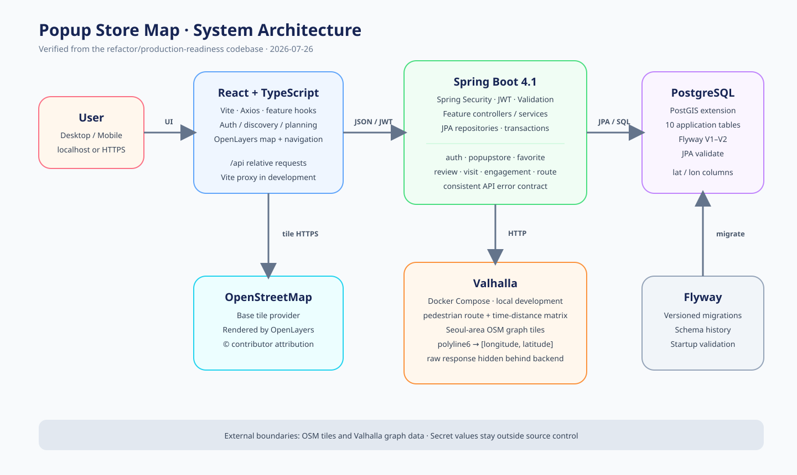
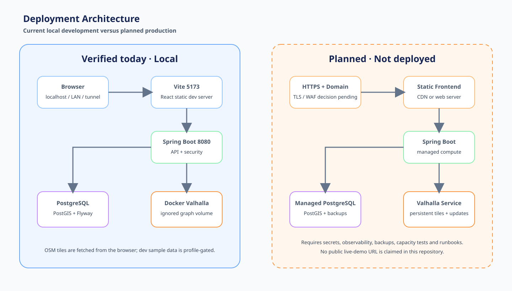

# System Architecture

이 문서는 2026-07-26의 `refactor/production-readiness` 코드와 설정을 기준으로 작성했다. 배포되지 않은 구성을 운영 중인 것처럼 표현하지 않는다.

## Runtime flow

1. 사용자는 React/Vite SPA에서 팝업을 탐색하고 일정과 경로를 구성한다.
2. 프론트엔드는 `/api` 상대 경로로 Spring Boot API를 호출한다. 개발 환경에서는 Vite proxy가 `127.0.0.1:8080`으로 전달한다.
3. Spring Security가 JWT와 역할을 검증한다. 조회 API는 공개하고 팝업 관리 API는 `ADMIN`만 허용한다.
4. Controller는 검증된 DTO를 application service에 전달한다.
5. Service의 transaction boundary 안에서 Spring Data JPA repository가 PostgreSQL/PostGIS를 조회·변경한다.
6. Flyway가 스키마를 관리하고 JPA는 `ddl-auto=validate`로 매핑 정합성을 확인한다.
7. 도보 경로 요청은 backend가 Valhalla에 전달한다. Valhalla의 polyline6 shape를 `[longitude, latitude]` 좌표로 변환해 필요한 정보만 응답한다.
8. OpenLayers는 OpenStreetMap 타일, 팝업 마커, 현재 위치, 정확도, 보행 경로를 서로 다른 layer로 렌더링한다.

## Logical layers

| Layer | Responsibility | Representative modules |
|---|---|---|
| Presentation | HTTP parsing, validation, response contract | `auth`, `popupstore`, `favorite`, `review`, `visit`, `route` controllers |
| Application | use case orchestration and transaction boundary | auth, popup query/command/ranking, review, engagement, route services |
| Persistence | database access and aggregate queries | Spring Data repositories |
| Infrastructure | JWT, CORS, Flyway, Valhalla HTTP client | `common.config`, auth security, route client |
| Client | discovery, authentication, map and navigation UX | React components, feature hooks, API modules, OpenLayers map |

## Current local topology

- React/Vite: `http://localhost:5173`
- Spring Boot: `http://localhost:8080`
- Swagger UI (dev only): `http://localhost:8080/swagger-ui/index.html`
- PostgreSQL/PostGIS: local development database
- Valhalla: Docker Compose service using Seoul-area OSM graph data
- OSM tiles: browser requests OpenStreetMap tiles directly

## Deployment boundary

The left side of the deployment diagram is verified local development. The right side is a target architecture and has not been deployed:

- HTTPS entry point and a static frontend host/CDN
- Spring Boot runtime
- PostgreSQL with PostGIS support
- persistent Valhalla tiles and an independently operated routing service
- managed secrets and observability

Production work still requires a concrete AWS account/network design, TLS/domain setup, backup and restore drills, monitoring, and load testing.

## Design decisions

- Keep the feature/domain package structure instead of introducing a framework-heavy architecture.
- Keep latitude/longitude columns because measured use cases do not yet justify a geometry migration.
- Keep Valhalla behind the backend so the frontend does not depend on an internal routing host or raw server response.
- Use refresh-token hashing and rotation rather than persisting reusable raw refresh tokens.
- Do not add Redis, Elasticsearch, Kafka, or a spatial index without a measured bottleneck and an operational plan.
