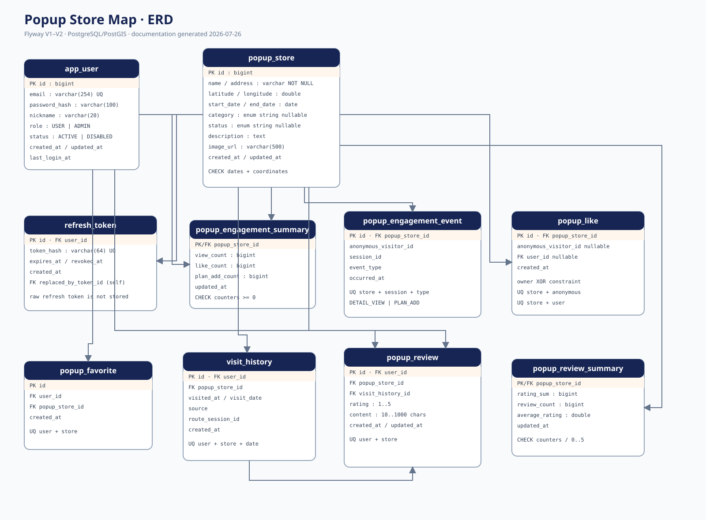

# Database ERD

The ERD is generated from the Flyway migrations, not inferred from UI behavior. The editable source is [`schema.dbml`](schema.dbml).



## Schema ownership

```text
Flyway migrations → PostgreSQL schema ← JPA ddl-auto=validate
```

- `V1__create_application_schema.sql` creates the application schema and PostGIS extension.
- `V2__align_existing_schema.sql` safely aligns previously created development databases.
- Flyway is authoritative; the DBML and SVG are documentation artifacts.

## Aggregate boundaries

- **Member/auth:** `app_user`, `refresh_token`
- **Popup catalog:** `popup_store`
- **Engagement/ranking:** `popup_engagement_event`, `popup_engagement_summary`, `popup_like`
- **Personal activity:** `popup_favorite`, `visit_history`
- **Review:** `popup_review`, `popup_review_summary`

## Integrity rules

- User email and refresh token hash are unique.
- Popup dates and coordinate ranges are checked by the database.
- A like belongs to either an anonymous visitor or a member, never both.
- Favorite, daily visit and per-popup review duplicates are blocked with composite unique constraints.
- Review rating/content ranges are enforced in both validation and database constraints.
- Summary tables reject negative counters; review average is bounded to 0–5.

## Spatial scope

PostGIS is installed, but the current entity stores `latitude` and `longitude` as `double precision`. No geometry/geography column or GiST index is claimed. A migration is deferred until a measured radius/distance-query requirement justifies it.
