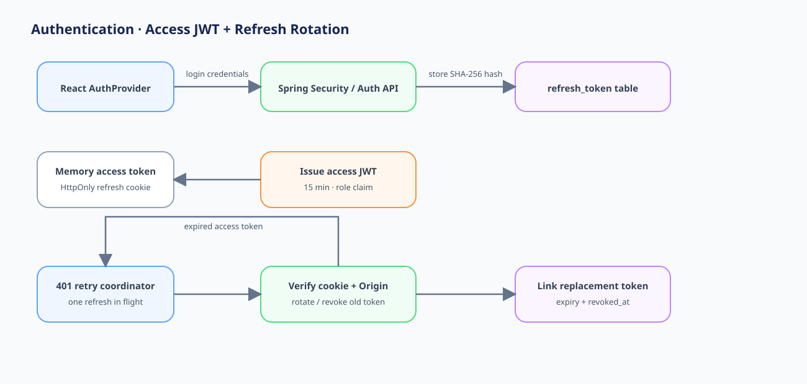
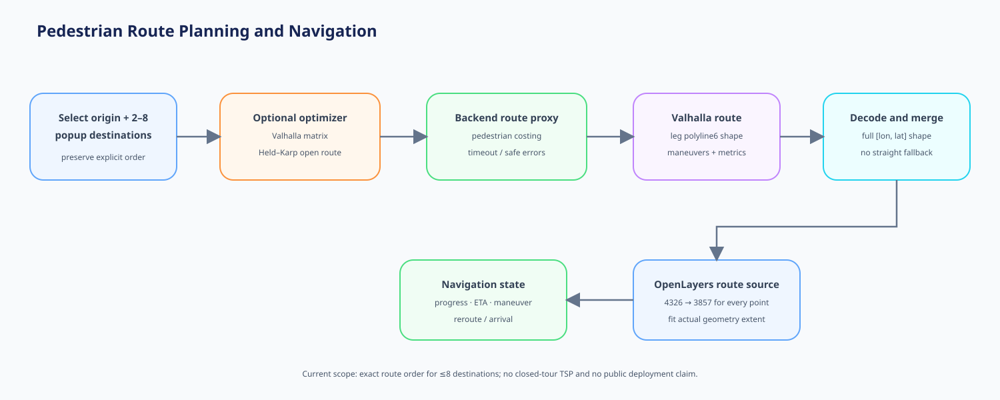

# Feature Flows

## Authentication and refresh rotation

1. Login verifies BCrypt password and returns a short-lived access JWT.
2. A random refresh token is delivered only as an HttpOnly cookie.
3. The database stores the token's SHA-256 hash, expiry, revocation and replacement relationship.
4. Refresh verifies the cookie and request origin, revokes the old token and creates a replacement.
5. Frontend retry coordination prevents multiple simultaneous refresh calls from racing.
6. Logout revokes the refresh token and clears the cookie.

## Popup discovery

1. Home requests featured/current/upcoming data and catalog content.
2. Search combines optional keyword, category, status and operating-date filters with paging/sorting.
3. Card and map marker share active/selected popup state.
4. Detail view records a de-duplicated engagement event and shows review summary/list.

## Visit and review

1. Navigation arrival or manual confirmation records at most one visit per member/popup/date.
2. A review create request verifies the authenticated member has a qualifying visit.
3. One review per member/popup is enforced by service rules and a unique constraint.
4. Only the review owner can update/delete it.
5. Review summary is maintained transactionally.

## Route planning and navigation

1. User selects 2–8 popups and an origin without changing popup entity schema.
2. Optional optimizer requests a Valhalla pedestrian matrix and applies exact open-route dynamic programming.
3. Backend calls Valhalla with the selected order and `pedestrian` costing.
4. Each leg's polyline6 shape is fully decoded and merged; waypoint-only straight-line fallback is not used.
5. Frontend transforms every response coordinate from EPSG:4326 to EPSG:3857.
6. OpenLayers updates an existing route source, fits the route extent and preserves marker/current-location layers.
7. Navigation tracks progress, remaining distance, ETA, next maneuver and rerouting state.
