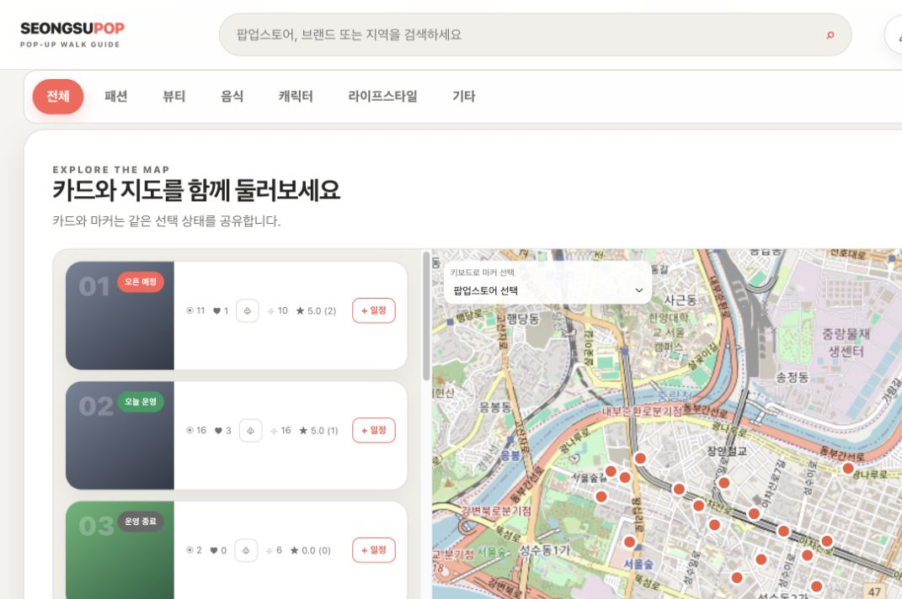

# Screen Inventory

The inventory is derived from the current React components and a localhost smoke test. The screenshots use development seed data and do not claim a public deployment.

## 1. Discovery home

- Integrated header with brand, search, account menu, theme and shortcuts
- Hero that explains the discover → plan → walk journey
- Category filters and featured/current/upcoming popup sections
- Popup cards with status, address, period, engagement and schedule action

## 2. Map exploration

- Result cards and OpenLayers map share the active popup state
- Eighteen development markers are rendered from API coordinates
- Keyboard-accessible popup selector complements pointer marker interaction
- GPS/follow, north-up and rotation controls are available
- Popup details open without removing the surrounding discovery context

## 3. Responsive home

- Header actions and search adapt to a narrow viewport
- Hero, filters and card rails remain reachable without horizontal page overflow
- Bottom sheets and cards account for mobile safe areas

## 4. Authentication

- Login and sign-up share a focused sheet
- Labels, password visibility action, close control and selected tab are exposed to assistive technology
- Access tokens remain in application memory; refresh is handled by an HttpOnly cookie

## 5. Popup detail and reviews

- `PopupStoreDetails` presents name, status, category, period, address and description.
- `PopupReviews` lists rating/content and allows an eligible signed-in visitor to create a review.
- Owners may update or delete their own review; the server is the final authorization boundary.

## 6. Route planner

- Users select 2–8 popup destinations while preserving an explicit visit order.
- Origin can be Seongsu Station, current position, or the first selected popup.
- Route optimization is opt-in and returns an exact open-route order for at most eight destinations.
- The route panel shows pedestrian distance, time, origin, destination and maneuver guidance.

## 7. Navigation and current location

- OpenLayers renders accuracy circle, current-position marker, heading triangle and heading cone.
- GPS modes progress through locate, follow and heading-follow.
- Navigation shows remaining distance, ETA, next maneuver, progress and rerouting state.
- Geolocation requires localhost or HTTPS and browser/OS location permission.

## 8. Member area

- Authenticated users can inspect favorites, visit history and authored reviews.
- Anonymous likes can be merged at login, while member-only data remains scoped by authenticated user id.

## State coverage

| Screen | Loading | Empty | Error | Auth required |
|---|---:|---:|---:|---:|
| Discovery/search | Yes | Yes | Yes | No |
| Popup detail/reviews | Yes | Yes | Yes | Review write only |
| Route planner | Yes | Selection guidance | Yes | No |
| Favorites/visits/my reviews | Yes | Yes | Yes | Yes |
| Authentication | Submit state | N/A | Yes | N/A |
